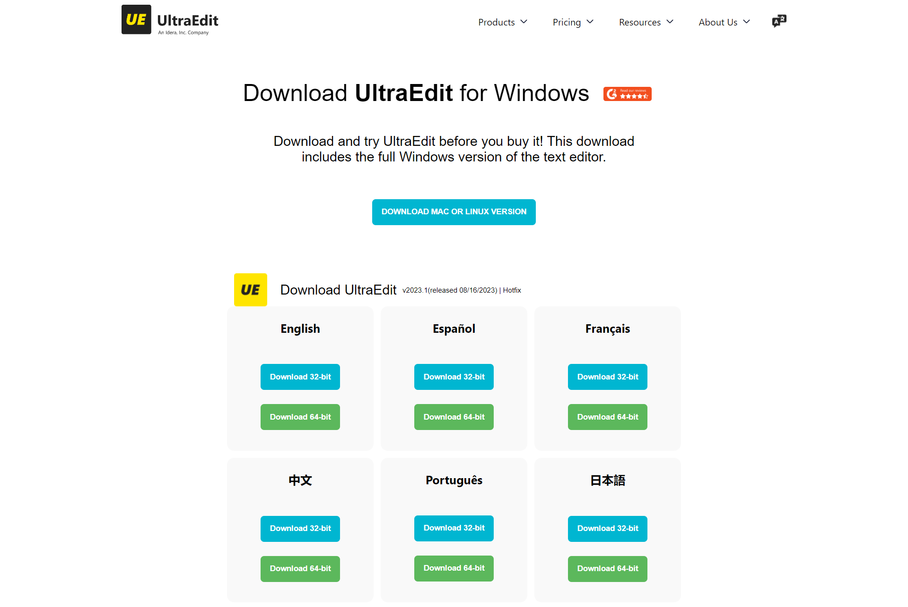

<h1>UltraEdit_Website_Clone(Work In Progress)</h1>
 

A clone of the UltraEdit website created using HTML and CSS.
 
<h2>Introduction</h2>
This project is a frontend clone of the UltraEdit website. It serves as a demonstration of my skills in HTML and CSS, showcasing my ability to recreate a complex website layout.
 
<h2>Features</h2>
Responsive Design: The website is fully responsive and adapts to different screen sizes.
Modern Layout: Utilizes modern design principles to recreate the look and feel of the UltraEdit website.
Customizable: Easy to customize and extend to fit different needs.
 
<h2>Usage</h2>
After cloning the repository, open the index.html file in your preferred web browser to view the website. Feel free to explore the code and customize it as needed for your own projects.
 
<h2>Contributing</h2>
Contributions are welcome! If you find any issues or have suggestions for improvement, please open an issue or submit a pull request. Your feedback is highly appreciated.

<h1>Demo</h1>
https://devloperpratikjadhav.github.io/UltraEdit-Clone/

